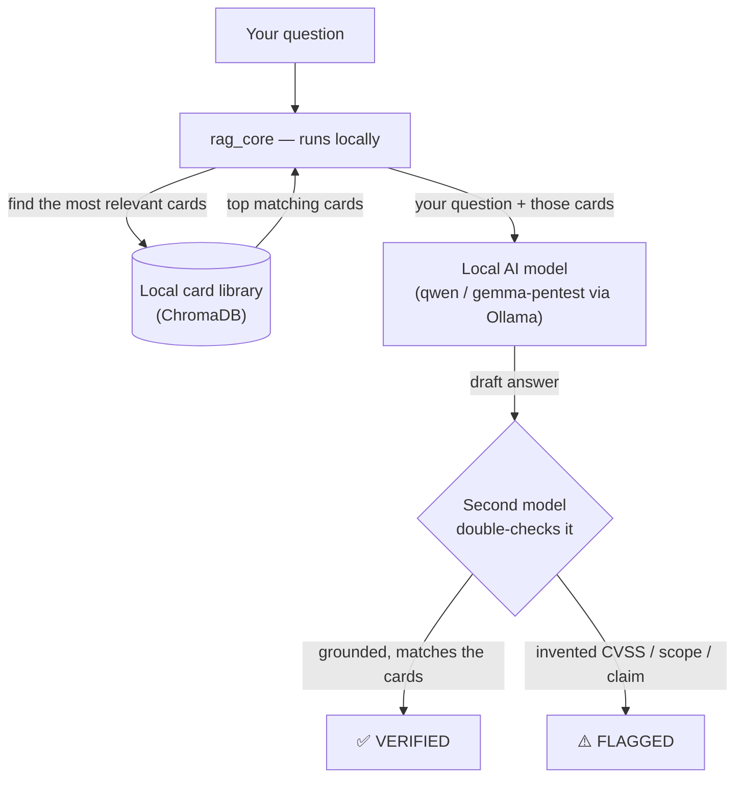
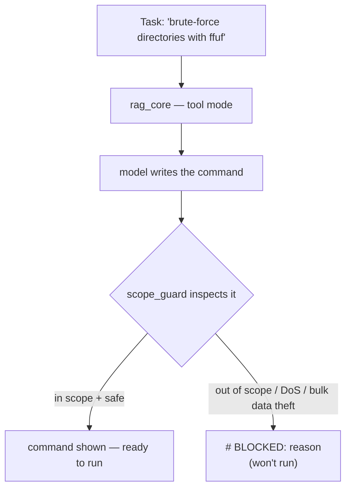

# omniscience-cyber

**An offline AI assistant for authorized penetration testing — it answers with working payloads
and honest scoring instead of refusing or making things up, and it runs entirely on your own
machine.** No cloud, no API keys, nothing leaves the box.

> ⚠️ **Authorized use only.** For lawful security work — pentests under a signed engagement,
> bug-bounty programs within scope, CTFs, and defensive research. It produces real exploit code
> because a vulnerability report needs a working proof-of-concept. You are responsible for only
> testing systems you have explicit written permission to assess.

---

## Why it exists

Generic chatbots are the wrong tool for offensive security twice over:

1. **They refuse.** Ask for a working SQLi string or a JWT-forgery script and you get a lecture —
   even for a sanctioned pentest where that proof-of-concept *is* the deliverable.
2. **They make things up.** The ones that do answer will confidently invent a CVSS score, a
   payload, or an "is this in scope?" call — and in security work a made-up fact costs you points
   or causes real harm.

omniscience-cyber fixes both, offline: local models tuned not to refuse legitimate work, answers
**grounded in a built-in library of hand-written security cards** (so they're cited, not guessed),
and a **second model that double-checks** the first for invented scores or claims.

## How it works

You ask a question. The tool finds the most relevant security cards from its local library, hands
them to a local AI model along with your question, and (optionally) has a second model check the
answer against those same cards before you trust it.



Nothing in that diagram touches the internet after the first-time setup.

## What you can ask it for

Four modes, one library of cards behind all of them:

| You want… | Command | What you get |
|---|---|---|
| A grounded, cited answer | `ask` | An explanation with a real CVSS score, citing which card it used |
| A ready-to-run tool command | `tool` | The exact Kali command (ffuf, sqlmap, nmap…), safe to paste into a shell |
| How to **fix** a bug you found | `harden` | Prioritized remediation: root cause → fix → interim control → how to re-test |
| A safety double-check | `verify` | A second model confirms the answer or flags a made-up score/claim |

## Set it up (first time only)

You need [Ollama](https://ollama.com) and Python 3.10+. Then, copy-paste:

```bash
# 1. install the Python dependencies
pip install -r requirements.txt

# 2. download a base model and wrap it with the tuned "don't refuse legit work" prompt
ollama pull qwen2.5-coder:7b
ollama create qwen-pentest -f modelfiles/qwen-pentest.Modelfile

# 3. copy the example config, then edit it to add your authorized targets
cp config.example.yaml config.yaml
#    open config.yaml and set guardrails.in_scope_hosts to the hosts you're allowed to test

# 4. load the security cards into the local search index (takes a few seconds)
python rag/rag_core.py ingest cards
```

That's it — you're ready. (On a GPU box you can also build the bigger models: run
`make models`, or see `modelfiles/`.)

## Use it from the command line

Copy-paste any of these:

```bash
# Ask a question — get a grounded answer with a real CVSS score and the card it used
python rag/rag_core.py ask "how do I test for IDOR and score it?"

# Get a ready-to-run tool command (safe to paste into a shell)
python rag/rag_core.py tool "directory brute force the target with ffuf"

# Ask how to FIX something you found (defensive / blue-team mode)
python rag/rag_core.py harden "the login page reflects the 'next' parameter into a redirect"

# Sanity-check that the two-model verifier works (Ollama must be running)
python rag/verify.py --self-test
```

Prefer the safe wrapper for tool commands — it shows you the command and waits for you to
confirm before running anything (it never blind-pipes to your shell):

```bash
scripts/kali_run.sh "sqli test the login parameter with sqlmap"
```

## Use it from Kali or another machine (the HTTP API)

Start a small local web server so other tools can talk to it. By default it only listens on your
own machine:

```bash
python rag/api.py --host 127.0.0.1 --port 8600
```

Then, from another terminal, copy-paste:

```bash
# is it up?
curl -s localhost:8600/health

# ask a question
curl -s localhost:8600/ask -d '{"q":"how do I test for IDOR and score it?"}'

# ask, and have the second model verify the answer
curl -s localhost:8600/ask -d '{"q":"what is the CVSS for reflected XSS?","verify":true}'

# get a ready-to-run command (plain text, one command per line)
curl -s 'localhost:8600/tool?task=directory+brute+force+with+ffuf'

# ask how to fix a finding (blue-team mode)
curl -s localhost:8600/harden -d '{"q":"TLS 1.0 and RC4 are enabled on the login host"}'
```

`/ask` and `/harden` reply with JSON: `answer`, `model` (which model answered), `cards` (the
sources it cited), `citations` (each card with a relevance score), and — if you asked — `verdict`
(✅ VERIFIED or ⚠️ FLAGGED).

### Sharing it with teammates (turn on a password)

The API can generate real attack commands, so if you open it to your network you **must** set a
token first — otherwise it refuses to start. Copy-paste:

```bash
# pick a random token and start the server on the LAN
export OMNISCIENCE_API_TOKEN=$(openssl rand -hex 16)
python rag/api.py --host 0.0.0.0 --port 8600

# teammates include the token on every request
curl -s -H "Authorization: Bearer $OMNISCIENCE_API_TOKEN" \
     localhost:8600/ask -d '{"q":"how do I test for IDOR?"}'
```

Other built-in safety: only `/health` is open without the token, request bodies are size-capped,
and every request is written to an append-only log (`logs/audit.jsonl`, git-ignored) so you have a
record of what was asked during an engagement. Disable the log with `audit_log: false` in your
config.

## Staying in scope — the built-in guardrail

Telling a model "stay in scope" is not a control. `rag/scope_guard.py` is the real one: every
command the `tool` mode produces is checked **before** you can run it, and anything that breaks
your rules of engagement is blocked (turned into a `# BLOCKED: reason` line that a shell safely
skips).



It blocks two things, using the `in_scope_hosts` and `forbid` lists from your `config.yaml`:

- **Out-of-scope targets** — any host/IP not on your `in_scope_hosts` list (it understands exact
  hosts, subdomains, and ranges like `10.10.0.0/24`). If you haven't set a scope list yet, it
  *warns* instead of blocking.
- **Dangerous actions** — denial-of-service flags (`--flood`, `nmap -T5`), bulk data theft
  (`sqlmap --dump-all`), unthrottled brute force (`hydra` with no limit), and similar.

Try it (no AI model needed for this part):

```bash
make test-guard
python rag/scope_guard.py "sqlmap -u https://prod.example.com/x?id=1 --dump-all"
# verdict: block  →  # BLOCKED: bulk_real_pii_exfiltration: sqlmap --dump-all ...
```

## The AI models (`modelfiles/`)

Each model is the latest open weights wrapped with the **same tuned no-refuse system prompt** and a
**per-model inference setup** (sampling tuned to how that family runs best). Build only the ones
your hardware can handle — `make models` skips any whose base isn't pulled. VRAM notes assume a
16GB GPU; "offload" means it runs but spills to CPU/RAM (slower).

| Model | Base | ~Size | 16GB | Best for |
|---|---|---|---|---|
| `muse-pentest` | `muse-glimmer` | 30B | offload | **Top agentic/coding** — Meta 30B, beats gemma4-31b / qwen3.6-27b |
| `qwen3.8-pentest` | `qwen3.8` | 27B | tight | Newest Qwen — big jump over 3.6, strong all-rounder |
| `qwen3-pentest-30b` | `qwen3-coder:30b` | 30B | offload | Coder-specialized 30B — strongest raw payloads (≈ qwen3.8) |
| `qwen3.6-pentest` | `qwen3.6:35b` | 35B | offload | Largest — deep agentic reasoning |
| `nemotron-pentest` | `nemotron-3.5-lightning` | 30B MoE | offload | **Fastest 30B** (~3B active) — quick agentic work |
| `mistral-pentest` | `mistral-small:24b` | 24B | tight | Balanced code + reasoning |
| `codestral-pentest` | `codestral:22b` | 22B | **fits** | **Recommended 16GB default** — coder, fits comfortably |
| `gemma4-pentest` | `gemma4:12b` | 12B | **fits** | Laptop-friendly reasoning / report writing |
| `qwen-pentest-14b` | `qwen2.5-coder:14b` | 14B | **fits** | Optional small coder (the one pre-2025 base) |
| `qwen-pentest` · `qwen-pentest-32b` · `gemma-pentest` | qwen2.5 / gemma3 | 7B–32B | mixed | Original wrappers (kept) |

Model ranking (which one the two-model verifier trusts to override which) is informed by
mid-2026 agentic/coding benchmarks — tune it in `config.yaml` under `model_rank`.

"Tuned not to refuse" means **no needless refusals on legitimate authorized work** — full payloads,
exploits, and PoCs, no lectures or disclaimers. It does *not* mean "trust it blindly": the models
are still told never to invent a fact (so CVSS scores are real) and to keep testing impact-limited
and in-scope. If a model errors or returns nothing, the tool falls back to the next one in your
config, so a single model failing never breaks your workflow. And `scripts/ask.sh` adds a second
layer: if a model hedges on a legitimate request, it re-frames the ask and routes to a more
compliant model.

## The knowledge — security cards (`cards/`)

The heart of the project is **34 hand-written security cards**, one concept each: IDOR/BOLA,
SQLi/NoSQLi, JWT/auth, RCE, SSTI, XXE, deserialization, GraphQL, path traversal, SSRF, XSS, CORS,
OAuth/SSO, HTTP request smuggling, file upload, race conditions, open redirect, subdomain takeover,
CSRF, business-logic, PII, Android/iOS, cloud & IAM, Active Directory, network & TLS, recon, and a
defensive hardening advisor. Each is distilled from authoritative sources (OWASP, PortSwigger, CWE,
CVSS v3.1) — see **[REFERENCES.md](REFERENCES.md)**.

**Why cards, not raw docs:** small, focused cards keep the search sharp and the answers grounded —
the model gets exactly the one relevant concept, not paragraphs of a 200-page guide.

**Add your own knowledge:** drop any `.md` file into `cards/` and re-run the ingest step:

```bash
python rag/rag_core.py ingest cards
```

To turn a PDF (a standard, a manual, a methodology) into a clean card, use the companion
**[pdf-to-llm-plugin](https://github.com/Saptarshi-Nag189/pdf-to-llm-plugin)**.

## Configuration (`config.yaml`)

You own the policy. In `config.yaml` you set your in-scope hosts, forbidden actions, which models
to use and in what order, and how retrieval is tuned. These aren't just suggestions to the model —
`in_scope_hosts` and `forbid` are actually enforced on every generated command, and the API layers
a token and an audit log on top. See `config.example.yaml` for every option, commented.

## Offline by design

No cloud AI, no external API calls, no telemetry. Embeddings, generation, and the search index all
run locally. After the first model download it works fully air-gapped — exactly what engagements
with strict data-handling rules require.

## Related projects

- **[omniscience_pro](https://github.com/Saptarshi-Nag189/omniscience_pro)** — the general-purpose
  offline RAG this security-focused tool descends from.
- **[pdf-to-llm-plugin](https://github.com/Saptarshi-Nag189/pdf-to-llm-plugin)** — turn PDFs into
  clean cards for the `cards/` folder.

## License

MIT — see `LICENSE`.

## Disclaimer

Provided for authorized security testing and research only. The authors are not responsible for
misuse. Testing systems without authorization is illegal. Always operate within a signed
engagement, an in-scope bug-bounty program, or systems you own.
