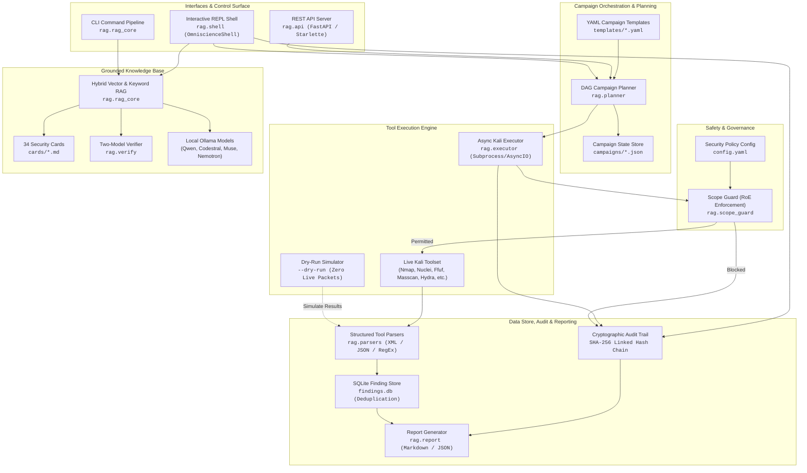
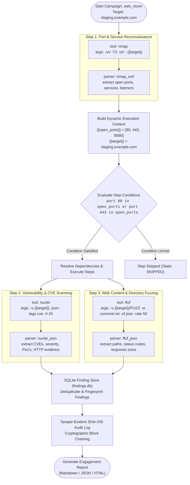
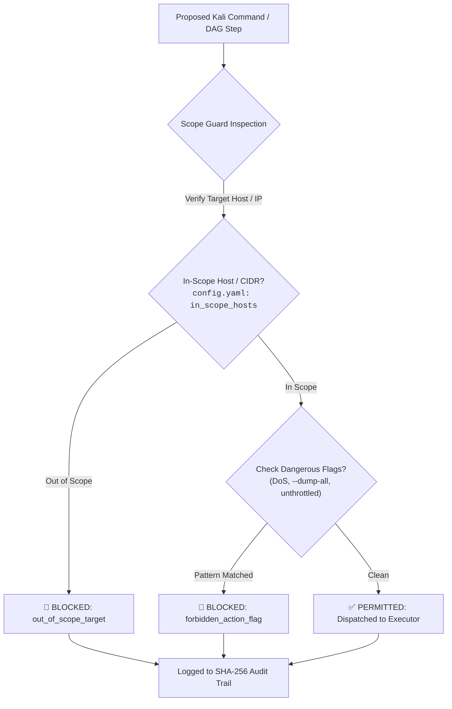

# omniscience-cyber

**An offline, autonomous AI penetration testing orchestrator and cybersecurity RAG framework — executing dynamic campaign DAGs, enforcing strict Rules of Engagement (RoE), and delivering verified findings with tamper-evident cryptographic audit trails.**

Runs 100% locally on your own machine. No cloud telemetry, no API keys, and nothing leaves the environment.

> [!WARNING]
> **Authorized use only.** This software is designed exclusively for lawful security assessments — authorized pentests under a signed Rules of Engagement (RoE), bug-bounty programs within explicit scope, CTFs, and defensive security research. It produces real exploit payloads, executes security tools, and automates attack surface discovery. You are strictly responsible for ensuring you have written authorization before testing any target.

---

## Architecture Overview

`omniscience-cyber` brings together local language models, a knowledge retrieval base of 34 security cards, dynamic directed acyclic graph (DAG) campaign planning, automated tool parsers, SQLite-backed deduplication, and a cryptographic SHA-256 hash-chained audit trail into a unified offensive security orchestrator.

### Multi-Agent Orchestration Architecture



---

## Campaign DAG Execution Workflow

Security assessments require dynamic tool chaining where downstream tasks depend on the output of upstream discovery (e.g., discovering open web ports with Nmap before launching Nuclei or Ffuf). `omniscience-cyber` models campaigns as Directed Acyclic Graphs (DAGs) defined in YAML templates with variable interpolation and conditional execution.



### Context Variable Interpolation

Campaign steps can dynamically reference runtime variables populated by earlier steps:

| Variable | Description | Source |
|---|---|---|
| `{{target}}` | Primary target host, domain, or IP | Campaign definition or `target` command |
| `{{open_ports}}` | Comma-separated list of discovered open ports | Extracted from `nmap_xml` or `masscan_json` parser |
| `{{web_ports}}` | Filtered HTTP/HTTPS ports (80, 443, 8080, 8443) | Extracted from port scan results |
| `{{username}}` | Username for authenticated assessments | User parameters or credential store |
| `{{password}}` | Password or hash for authenticated assessments | User parameters or credential store |
| `{{domain}}` | Active Directory domain name / realm | Extracted during domain enumeration |

---

## Interactive REPL & Campaign Commands

The interactive shell (`rag/shell.py`) provides an autonomous command-and-control REPL for managing targets, DAG planning, stepped execution, finding triage, and RAG-grounded advisory.

### Launching the Shell

```bash
# Launch interactive REPL in safe dry-run mode (no live tool execution)
python -m rag.shell --dry-run

# Launch targeting a specific host with custom template
python rag/shell.py --target staging.example.com --template web_recon

# Execute non-interactive automated campaign
python -m rag.shell --run 10.10.10.5 --template infra_recon --dry-run
```

### Command Reference

| Command | Arguments | Description |
|---|---|---|
| `target` | `[host]` | Set or inspect the active target host/IP/URL. |
| `plan` | `[target] [template]` | Compile and display a campaign DAG without running any steps. |
| `run` | `[target\|id] [template]` | Execute a new or existing campaign end-to-end (respects `--dry-run`). |
| `step` | `[campaign_id]` | Execute exactly one ready step in the campaign DAG and pause. |
| `status` | `[campaign_id]` | Display step-by-step progress, states (`PENDING`, `COMPLETED`, `BLOCKED`), and summary statistics. |
| `findings` | `[id] [severity]` | List deduplicated findings filtered by severity (`critical`, `high`, `medium`, `low`, `info`). |
| `export` | `[id] <filename>` | Export an executive report to Markdown (`.md`) or structured JSON (`.json`). |
| `audit` | `[campaign_id]` | Verify the cryptographic integrity of the SHA-256 hash chain and inspect recent events. |
| `ask` | `<query>` | Query the local grounded RAG knowledge base (returns cited security cards & CVSS scores). |
| `tool` | `<query>` | Generate safe, syntax-checked Kali commands verified against Scope Guard. |
| `harden` | `<query>` | Generate defensive remediation plans (root cause → fix → interim control → retest). |
| `list` | — | List all stored campaigns, targets, execution states, and finding counts. |
| `show` | `[campaign_id]` | Show detailed DAG step hierarchy, dependencies, conditions, and commands. |
| `use` | `<campaign_id>` | Switch the currently active campaign context. |
| `pause` | `[campaign_id]` | Pause an active campaign execution. |
| `resume` | `[campaign_id]` | Resume a paused or interrupted campaign. |
| `help` | `[command]` | View inline documentation and command help. |
| `exit` / `quit` | — | Safely exit the REPL shell (handles `Ctrl+D` / `EOF` cleanly). |

---

## Dynamic YAML Templates

Campaign templates are stored in `templates/*.yaml` and define multi-step attack graphs.

### Template Anatomy

```yaml
name: Web Application Reconnaissance
description: "Full web app recon: nmap -> nuclei -> ffuf"
steps:
  - id: recon_nmap
    tool: nmap
    args: ["-sV", "-T2", "-oX", "-", "{{target}}"]
    parser: nmap_xml
    description: "Service detection on target"
    timeout: 300

  - id: recon_nuclei
    tool: nuclei
    args: ["-u", "{{target}}", "-json", "-tags", "cve", "-rl", "20"]
    parser: nuclei_json
    description: "CVE/misconfiguration scan"
    timeout: 600
    depends_on: ["recon_nmap"]

  - id: recon_ffuf
    tool: ffuf
    args: ["-u", "{{target}}/FUZZ", "-w", "/usr/share/seclists/Discovery/Web-Content/common.txt", "-of", "json", "-rate", "50"]
    parser: ffuf_json
    description: "Directory brute force"
    timeout: 600
    depends_on: ["recon_nmap"]
    condition: "port 80 in open_ports or port 443 in open_ports"
```

### Built-in Templates

| Template | Path | Workflow & Tools |
|---|---|---|
| `web_recon` | `templates/web_recon.yaml` | Service discovery (`nmap`) → CVE scan (`nuclei`) + Directory discovery (`ffuf`) |
| `infra_recon` | `templates/infra_recon.yaml` | Fast port scan (`masscan`) → Service detection (`nmap`) → Network CVE scan (`nuclei`) |
| `ad_enum` | `templates/ad_enum.yaml` | AD Port scan (`nmap`) → LDAP Enum (`enum4linux-ng`) → Attack path mapping (`bloodhound`) |
| `mobile_recon` | `templates/mobile_recon.yaml` | APK decompilation (`apktool`) → Static security analysis (`mobsf`) |

---

## Scope Guard & Rules of Engagement (RoE)

The **Scope Guard** (`rag/scope_guard.py`) is an active safety firewall that inspects every single tool command **before** execution.



### Enforced Guardrails

1. **Target Boundary Enforcement**:
   - Subnet CIDR matching (`10.10.0.0/24`, `192.168.1.0/24`).
   - Domain and wildcard subdomain matching (`*.staging.example.com`).
   - Rejects unlisted IP addresses and foreign hostnames.
2. **Forbidden Attack Patterns**:
   - **Denial of Service (DoS)**: Blocks `--flood`, `nmap -T5`, unthrottled concurrency flags.
   - **Bulk Data Theft / Exfiltration**: Blocks `sqlmap --dump-all`.
   - **Destructive Database Modification**: Blocks `--sql-query "DROP TABLE..."`, `--os-pwn` without interactive confirmation.
   - **Unthrottled Brute Force**: Enforces rate limiting on Hydra and Ffuf.

---

## Cryptographic Tamper-Evident Audit Trail

All operations (DAG planning, step execution, tool commands, Scope Guard verdicts, and finding detections) are committed to an append-only cryptographic ledger (`rag/audit.py`).

```
Entry 0 (Genesis):  Hash = SHA256(0000000000000000... + Entry_0_JSON)
Entry 1:            Hash = SHA256(Entry_0_Hash       + Entry_1_JSON)
Entry 2:            Hash = SHA256(Entry_1_Hash       + Entry_2_JSON)
...
```

- **Hash Algorithm**: SHA-256 with genesis seed `0000000000000000000000000000000000000000000000000000000000000000`.
- **Integrity Check**: The `audit` command and `verify_chain()` API traverse the log to detect modified, deleted, or inserted records.
- **Forensic Deliverables**: Audit logs are embedded directly into generated reports for defensible compliance proof.

---

## The Knowledge Base — Security Cards (`cards/`)

Answers and tool commands are grounded in **34 hand-written security cards** curated from OWASP Top 10, PortSwigger Web Security Academy, CWE, and CVSS v3.1 standards.

| Category | Card Files | Key Topics Covered |
|---|---|---|
| **Web Application Security** | `01_idor_bola.md`, `03_sqli.md`, `04_jwt_session_auth.md`, `12_xss_client_injection.md`, `14_file_upload.md`, `15_ssrf.md`, `17_csrf_clickjacking.md`, `18_ssti.md`, `19_xxe.md`, `20_insecure_deserialization.md`, `21_graphql.md`, `22_path_traversal_lfi.md`, `23_cors_misconfig.md`, `24_oauth_oidc.md`, `26_open_redirect.md`, `29_http_request_smuggling.md`, `30_nosql_injection.md` | BOLA/IDOR, Blind SQLi, JWT Forgery, Stored XSS, SSRF, Polyglot Payloads, GraphQL Introspection, Path Traversal, CORS Origin reflection, OAuth token hijacking, HTTP Desync. |
| **Authentication & AuthZ** | `02_authz_privesc.md`, `07_business_logic_crud.md`, `16_verb_tampering_authz_matrix.md`, `25_race_conditions.md` | Horizontal/Vertical Privilege Escalation, CRUD workflow bypass, HTTP Verb Tampering (HEAD/PUT bypass), Limit-overrun race conditions. |
| **Infrastructure & Network** | `05_injection_rce.md`, `13_kali_tool_playbook.md`, `28_recon_attack_surface.md`, `31_cloud_iam_misconfig.md`, `32_active_directory.md`, `33_network_tls.md` | Command Injection, Kali Tool syntax, Passive/Active Recon, AWS/GCP IAM privilege escalation, Kerberoasting, AS-REP roasting, DCSync, TLS cipher suites. |
| **Mobile & Client** | `06_android_static.md`, `09_ios_mobile.md`, `08_pii_transport_client.md` | Android APK reverse engineering, iOS plist/Keychain leakage, Insecure Data Storage, PII logging. |
| **Methodology & Hardening** | `10_scope_methodology_dedupe.md`, `11_hardened_targets.md`, `27_subdomain_takeover.md`, `34_hardening_remediation.md` | Assessment methodology, WAF evasion, DNS dangling records, Prioritized blue-team remediation guides. |

---

## AI Models Catalog (`modelfiles/`)

`omniscience-cyber` uses local Ollama models wrapped with a specialized system prompt that eliminates false refusals while maintaining factual grounding and CVSS accuracy.

| Model Tag | Base Architecture | Size | 16GB GPU Status | Recommended Use Case |
|---|---|---|---|---|
| `muse-pentest` | Meta `muse-glimmer` | 30B | CPU Offload | **Top agentic/reasoning** — complex multi-step exploitation & analysis |
| `qwen3.9-pentest` | `qwen3.9` | 27B | CPU Offload | **Next-gen Qwen** — deep reasoning, coding, and autonomous DAG planning |
| `qwen3.8-pentest` | `qwen3.8` | 27B | Tight VRAM | High-performance all-rounder with strong PoC generation |
| `qwen3-pentest-30b` | `qwen3-coder:30b` | 30B | CPU Offload | Specialized exploit coding & script generation |
| `nemotron-pentest` | `nemotron-3.5-lightning` | 30B MoE | CPU Offload | **Fastest 30B class** (~3B active parameters) — rapid command generation |
| `codestral-pentest` | `codestral:22b` | 22B | **Fits Comfortably** | **Recommended default for 16GB VRAM** — balanced payload coding |
| `gemma4-pentest` | `gemma4:12b` | 12B | **Fits Comfortably** | **Laptop & edge devices** — fast reasoning and report summarization |
| `qwen-pentest-web` | `qwen2.5-coder:7b` | 7B | **Fits Comfortably** | Web application specialization (React, GraphQL, OAuth, Node, Django) |
| `qwen-pentest-infra` | `qwen2.5-coder:7b` | 7B | **Fits Comfortably** | Network & AD specialization (Kerberos, Lateral Movement, Cloud IAM) |
| `qwen-pentest-1.5b` | `qwen2.5-coder:1.5b` | 1.5B | **Fits Comfortably** | Ultra-lightweight CPU-only environments |

### Apple Silicon (MLX) Optimization

On Apple Silicon with unified memory, use the corresponding MLX builds:

| Wrapper Tag | MLX Base Model | Footprint |
|---|---|---|
| `muse-pentest` | `muse-glimmer:30b-mlx` | ~21 GB |
| `qwen3.9-pentest` | `qwen3.9:27b-mlx` | ~18 GB |
| `qwen3.8-pentest` | `qwen3.8:27b-mlx` | ~18 GB |
| `nemotron-pentest` | `nemotron-3.5-lightning:30b-a3b-mlx` | ~23 GB |
| `gemma4-pentest` | `gemma4:12b-mlx` | ~7.7 GB |

---

## Fine-Tuning & Benchmark (`eval/`)

A self-contained experiment that **quantifies** three ways to specialize one small base model
(`Qwen2.5-Coder-1.5B`) for authorized pentesting — raw base, custom-modelfile (uncensored via
system prompt), and **QLoRA fine-tuned** (uncensored + domain knowledge in the weights) — each
measured **with and without RAG**, for a **3 × 2 = 6** result matrix.

| Metric | Meaning | Direction |
|---|---|---|
| MCQ accuracy | 36 held-out multiple-choice security questions | higher |
| Refusal rate | 12 authorized-pentest asks refused/hedged | lower |
| Similarity / ROUGE-L | free-form answers vs gold references | higher |
| Groundedness | optional LLM-judge factual consistency | higher |

The gold test set is hand-authored from the cards and **disjoint** from the auto-generated training
pairs. Tuned to fit a 6GB-VRAM / 8GB-RAM laptop (4-bit QLoRA, LoRA-only, tiny batch), with a 0.5B
fallback. Full runbook: [`eval/README.md`](eval/README.md); results writeup: [`eval/RESULTS.md`](eval/RESULTS.md).

```bash
make bench-all  # ONE COMMAND: datasets -> baselines -> QLoRA -> ft model -> eval -> charts

# ...or step by step:
make data       # build gold + SFT datasets from the cards
make finetune   # QLoRA fine-tune (GPU; pip install -r requirements-train.txt)
make eval       # run the 6-config benchmark -> eval/results/results.csv
make plots      # render charts
make test-eval  # offline unit tests for the harness (no GPU/Ollama)
```

---

## HTTP REST API Server

For multi-host setups (e.g. running the AI model on a GPU workstation while Kali runs on a lightweight laptop), start the REST API:

```bash
# Start on loopback (default port 8600)
python rag/api.py --host 127.0.0.1 --port 8600

# Start on LAN with token authentication (mandatory for non-loopback)
export OMNISCIENCE_API_TOKEN=$(openssl rand -hex 16)
python rag/api.py --host 0.0.0.0 --port 8600
```

### API Endpoints

- `GET /health` — Service health and loaded model status.
- `POST /ask` — Grounded security questions with card citations and optional verification.
- `GET /tool?task=...` — Generate syntax-checked Kali commands.
- `POST /harden` — Generate defensive hardening recommendations.

```bash
# Query the API
curl -s -H "Authorization: Bearer $OMNISCIENCE_API_TOKEN" \
     http://localhost:8600/ask \
     -d '{"q":"How do I test for IDOR on /api/v1/users/{id} and calculate its CVSS?"}'
```

---

## Pytest Testing & Sandbox Verification

The complete test suite runs in sandbox mode without requiring live Kali binaries or active network connections.

```bash
# Run the entire test suite (118+ unit and integration tests)
pytest tests/ -v

# Run specific subsystem tests
pytest tests/test_shell.py -v         # REPL & command handlers
pytest tests/test_planner.py -v       # DAG planning & variable interpolation
pytest tests/test_executor.py -v      # Async execution & timeout handling
pytest tests/test_parsers.py -v       # Tool output parsers (Nmap, Nuclei, Ffuf, Masscan)
pytest tests/test_findings.py -v      # SQLite store & deduplication
pytest tests/test_audit.py -v         # SHA-256 hash chain & tampering detection
pytest tests/test_scope_guard.py -v   # RoE validation & flag blocking
pytest tests/test_report.py -v        # Markdown & JSON report generation
```

---

## First-Time Setup

### 1. Install Dependencies

```bash
pip install -r requirements.txt
```

### 2. Pull and Build Base Models

```bash
# Pull base model from Ollama
ollama pull codestral:22b

# Create tuned pentest wrapper
ollama create codestral-pentest -f modelfiles/codestral-pentest.Modelfile
```

### 3. Configure Scope & Guardrails

```bash
cp config.example.yaml config.yaml
# Edit config.yaml: specify in_scope_hosts and forbidden actions
```

### 4. Ingest Security Cards into Vector Index

```bash
python rag/rag_core.py ingest cards
```

---

## Configuration Reference (`config.yaml`)

```yaml
# Primary model for generation
chat_model: codestral-pentest
embedding_model: all-MiniLM-L6-v2
db_dir: db
cards_dir: cards

# Fallback sequence if primary model is unavailable
model_fallbacks:
  - codestral-pentest
  - gemma4-pentest
  - qwen-pentest-web
  - qwen-pentest-1.5b

# Guardrails & Rules of Engagement
guardrails:
  in_scope_hosts:
    - "staging.example.com"
    - "10.10.10.0/24"
  forbid:
    - pattern: "--flood"
      reason: "Denial of service attack vector prohibited"
    - pattern: "--dump-all"
      reason: "Bulk database exfiltration prohibited"
```

---

## Disclaimer

This software is strictly provided for authorized security testing, educational research, and defensive hardening. Testing systems without prior explicit written permission is illegal under computer crime laws (including the CFAA and Computer Misuse Act). The authors assume no liability for misuse.
